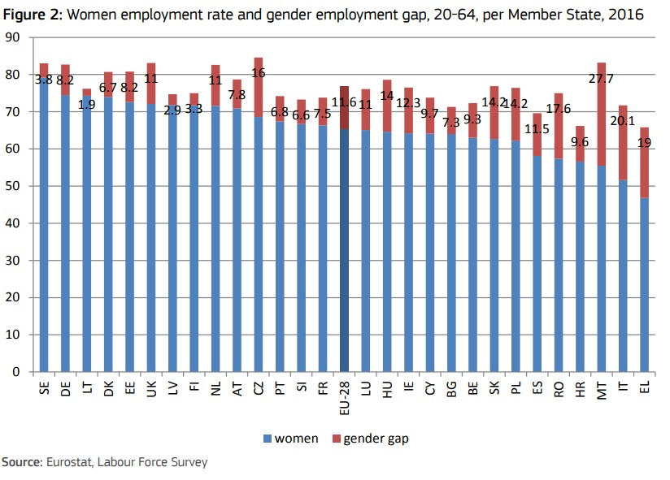

```{r setup, include=FALSE}
knitr::opts_chunk$set(echo = TRUE)
```

# Пример описательного анализа в исследовании "2018 Report on equality between women and men in the EU"
## Введение

В качестве примера исследования представляющего собой описательный анализ я выбрала отчет Европейской Комиссии 2018 года о равентстве между мужчинами и женщинами в Европейском союзе.
Найти отчет можно, опираясь на следующие данные:

| Format   | ISBN              | DOI                             |
| :--------|:------------------|:--------------------------------|
| Print    | 978-92-79-80188-4 |10.2838/21655 DS-AU-18-001-EN-C  |
| PDF      | 978-92-79-80189-1 |10.2838/168837 DS-AU-18-001-EN-C |


Либо скачать по ссылке:\
[Для скачивания нажмите сюда.](https://op.europa.eu/en/publication-detail/-/publication/950dce57-6222-11e8-ab9c-01aa75ed71a1/language-en)

Этот отчет подводит итоги основных инициатив, начатых или реализованных в 2017 г. в пяти тематических областях политики "Strategic Engagement": 

1. равная экономическая независимость женщин и мужчин;

2. равная оплата труда за равный вклад;

3. равенство в принятии решений;

4. окончание насилия на гендерной почве; и

5. продвижение гендерного равенства за пределами Евросоюза.

Основной фокус сделан на:

+ ключевые тренды и наиболее актуальные и новые данные об индикаторах "Strategic engagement";

+ действия в Евросоюзе, фокусирующиеся на достижениях участников и институов Евросоюза;

+ вдохновляющие практики, иновационные процессы и успешные политики.

## Обоснование

Из информации об отчете мы видим, что целью исследования является обзор, описание текущей ситуации с равенством между женщинами и мужчинами.
В исследовании не создается модель, не строятся прогнозы, не происходят манипуляции с переменными с целью исследования причинно-следственных связей, а так же не производится какая-то эстраполяция полученных на выборке выводов на генеральную совокупность\
В первую очередь оно фокусируется на сборе данных и оценке текущего состояния, а так же демонстрации тенденций на основании собранных данных.

В отличие от разведывательного анализа данный отчет не исследует взимосвязь между показателями равенства или неравенства с возможными причинами в качестве переменных, графики демонстрируют лишь сложивщуюся ситуацию между полами, и как она меняется в зависимости от возрастной группы, с течением времени или с точки зрения различных показателей и харектеристик.


### Примеры

В качестве примеров результатов данного исследования рассмотрим приведенные в нем графики, все они описательного характера и представляют собой сводку событий в исследуемых сферах.
В отчете содержится 17 графиков, здесь я продемонстрирую лишь некоторые из них, но все они схожи в своем описательном характере и отражают статистические данные, тренды и тенденции:\

<center>
{width=500px}
</center>


```{r, echo=FALSE, out.width="60%",fig.align='center'}
library(knitr)
include_graphics(c('ex_2.jpg', 'ex_3.jpg', 'ex_4.jpg'))

```


## Выводы

Таким образом, исходя из того, что все исследование заключается в сборе информации из источников статистических данных, фомировании графиков и таблиц на основании этих данных с целью их наглядного представления, изучения трендов, тенденций и текущего состояния в сферах равенства между мужчинами и женщинами, можно сделать вывод, что отчет является яркимим примером описательного анализа.

[Ссылка на Git](https://github.com/DariaGI/R_test)
